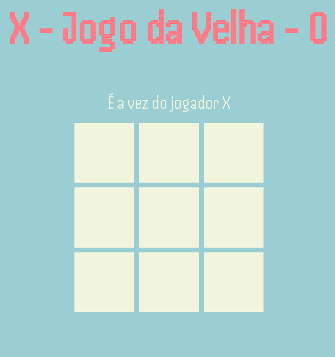
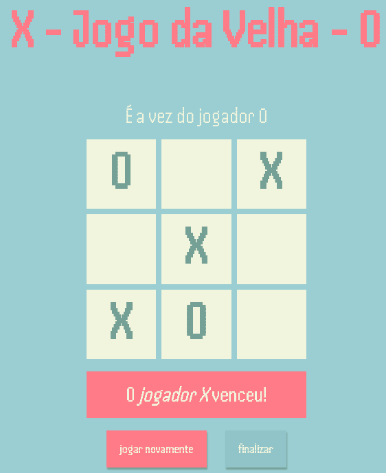
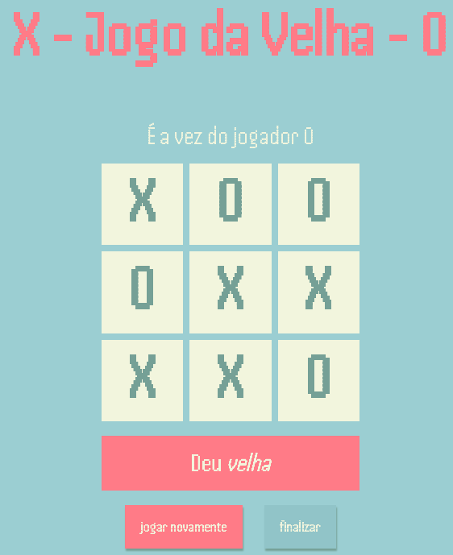

<h1>Jogo da velha</h1>

<h2>Sobre</h2>

    Neste projeto contruí um jogo simples conhecido como Jogo da Velha. Nele busquei aplicar conhecimentos básicos da linguagem JavaScript.

<h2>Overview</h2>

<h3>O tabuleiro</h3>

<h3>Tabuleiro quando há vencedor</h3>

<h3>Tabuleiro quando não há vencedor</h3>

<h3>Tela de despedida</h3>

<h2>Tecnologias utilizadas</h2>
<ul>
    <li>JavaScript</li>
    <li>HTML</li>
    <li>CSS</li>
<ul>